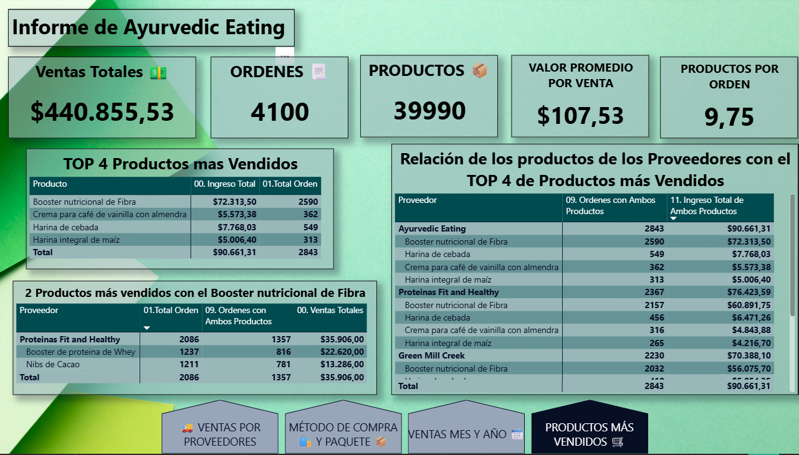

# Informe-AyurvedicEating-PBI

## Proyecto Informe Ayurvedic Eating
    AUTOR:MANUEL CHANOURDIE LLEVILAO

## SITUACIÓN:    
    AyurvedicEating.Com, ES una tienda en línea de comidas saludables y suplementos. Ayurvediceating.com tiene 4 principales proveedores: la misma empresa, que es responsable de la mayoría de los productos, y 3 empresas mas chicas, que complementan a la compañía con productos de nicho.
    Recientemente, la gerencia ha expresado interés en adquirir uno de los 3 proveedores más chicos. Hay un debate interno en la compañía sobre cual proveedor debería ser adquirido. 

    Los nombres de las empresas chicas son:
    Green Mill Creek, Comida Espiritual del Este, y Proteinas Fit and Healthy. 

## OBJETIVO:
    El objetivo de este análisis es obtener indicadores medibles y concretos, para determinar que empresa proveedora sería la mas conveniente en adquirir.

    Se realizó un dashboard en Power BI para apoyar la decisión proveyendo los siguientes datos: 
    • Ingreso Total de AyurvedicEating.com
    • Órdenes Totales
    • Productos promedio por orden
    • Ingreso promedio por orden
    • Ingresos totales de los 3 proveedores externos. Deberías de tener la opción de cambiar entre 
    doláres y como porcentaje del ingreso de AyurvedicEating.com
    • Los 4 mejores productos de AyurvedicEating (y sus ingresos)
    • Los 2 productos mejor emparejados (de proveedores externos) con el producto que mejor vende 
    de AyurvedicEating
    • Cuando ingreso de otros vendedores se genera junto con esos 

## Modelo de Relación PBI

## DASHBOARD

## Productos más vendidos y su relación con los proveedores:
 

## Ventas a travez del tiempo del 2016 al 2018 expresadas en meses y años:

## Ventas totales realizadas por los proveedores:

## Ventas expresadas por el metodo de adquisisión y tipo de paquete enviado:
